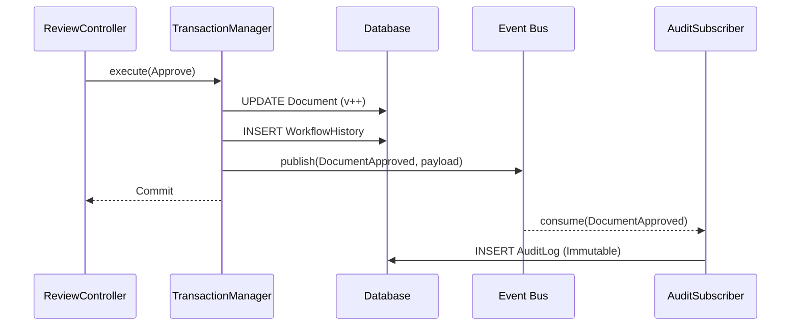
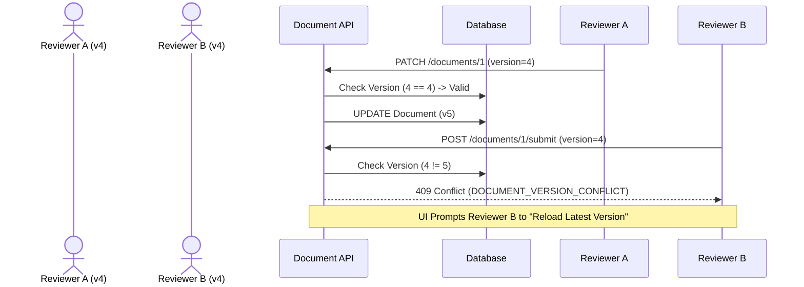

# Audit & Integrity Systems

The Audit System operates exclusively on an immutable append-only ledger (`AuditLog`). This ensures enterprise-grade traceability and compliance.

## Event-Driven Audit Flow
Instead of bloating the transaction boundaries with heavy analytical logging, the system leverages Domain Events (via the `globalEventBus`).

## Versioning & Conflict Resolution
Every modification to a document produces a `DocumentVersion` snapshot.

### Version Comparison
The `VersionService` fetches raw JSON snapshots and utilizes textual diffing to highlight `added` and `removed` strings, exposing this data via `/api/v1/documents/:id/compare`.

### Conflict Resolution Flow
Optimistic concurrency is strictly enforced across all state-mutating API routes.

