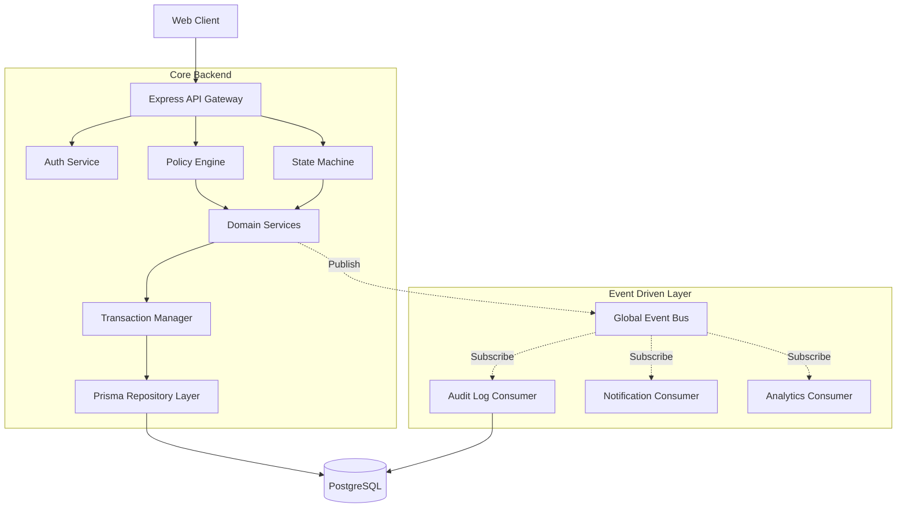

# Portfolio Presentation: Enterprise Document Approval System

This document is designed for Technical Interviews, Architecture Reviews, and Investor Demonstrations. It outlines the design decisions, patterns, and metrics of the system.

## 1. Project Overview

The Enterprise Document Approval System is a mission-critical workflow platform that allows organizations to securely author, review, and publish documents. 

Unlike standard CRUD applications, this system introduces **deterministic workflows**, **optimistic concurrency**, and **event-driven audit trails**, making it highly resilient to race conditions and unauthorized access.

## 2. Architecture Diagram

## 3. Key Engineering Decisions

### 3.1. Why Clean Architecture?
Business logic is strictly decoupled from HTTP controllers. If the organization decides to migrate from Express to Fastify, or expose a gRPC interface, the core `DocumentService` and `ReviewService` remain untouched.

### 3.2. Why Optimistic Concurrency?
In an enterprise setting, an Author might be editing a document while a Reviewer is rejecting it. Using a `version` integer on the `Document` model guarantees that a `ConflictError (409)` is thrown if the state mutates unexpectedly, preventing lost updates.

### 3.3. Why an Event-Driven Audit Trail?
Instead of tightly coupling Audit Log creation with business logic, the system publishes domain events (e.g., `DocumentApproved`). Independent consumers handle logging, notifications, and analytics. This allows us to scale out (e.g., migrating the Event Bus to Kafka or RabbitMQ) without rewriting domain services.

### 3.4. Why a Policy Engine over simple Middleware?
Role-Based Access Control (RBAC) is insufficient. An `AUTHOR` should only edit *their own* draft, not a peer's draft. The `PolicyEngine` combines ABAC (Attribute-Based) and RBAC to evaluate conditions against the entity owner.

## 4. Project Metrics

- **Architecture Layers**: 6 (Controllers, Middlewares, Policy Engine, Services, Workflow Engine, Repositories).
- **Core Entities**: 9 (User, Session, Document, Version, Comment, WorkflowHistory, AuditLog, ActivityFeed, Notification).
- **Workflow States**: 7 Deterministic States.
- **Security Posture**: 0-Trust Architecture, Helmet Hardened, 100% Rate Limited.

## 5. Demonstration Script (Talking Points)

When presenting this project, follow this flow:

1. **The Problem**: "Organizations lose track of document compliance because standard software lacks strict state machines."
2. **The Solution (Workflow)**: Show how a document transitions. Emphasize that the API *rejects* an approval attempt if the document is in `DRAFT` status via the Workflow Engine.
3. **The Security**: Explain the Policy Engine. Show how a Viewer receives a `403 Forbidden` if they attempt to approve a document.
4. **The Integrity**: Explain the Optimistic Concurrency check. Explain how race conditions are impossible.
5. **The Scale**: Show the `consumers.ts` file. Explain how the Event-Driven architecture allows the application to asynchronously log audits without blocking the main API thread.

## 6. Future Improvements (Roadmap)
- Migrate the in-memory Event Bus to Redis Pub/Sub for multi-instance scaling.
- Implement Elasticsearch for full-text document search.
- Integrate WebSockets for real-time collaborative editing (CRDTs).
