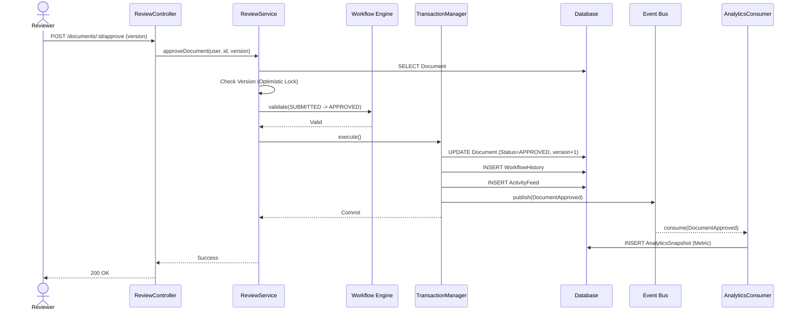
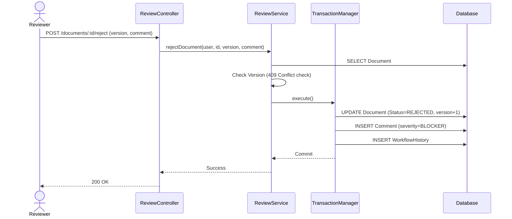

# Review System Architecture

The Review System is the core module for approving, rejecting, and publishing documents. It uses optimistic concurrency control to prevent conflicting reviews.

## Concurrency Control
When a reviewer opens a document, they view a specific `version` (e.g., v4). 
If another reviewer approves the document, the DB increments the version to v5.
If the first reviewer tries to reject, they send `version: 4`. The `ReviewService` checks if `currentVersion === incomingVersion`. If false, it throws a `409 Conflict`. The UI catches this and prompts the user to reload.

## Sequence Diagrams

### Approve Document

### Reject Document

