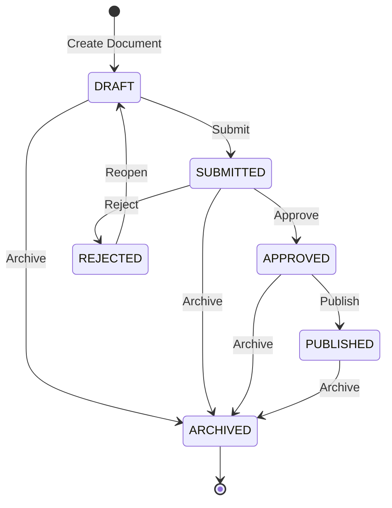
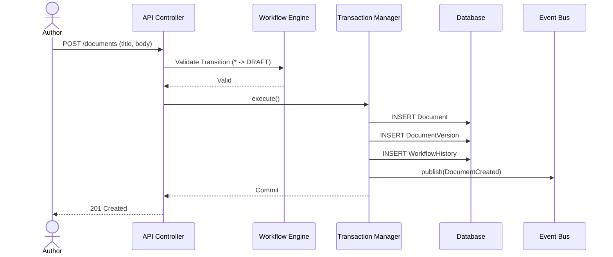
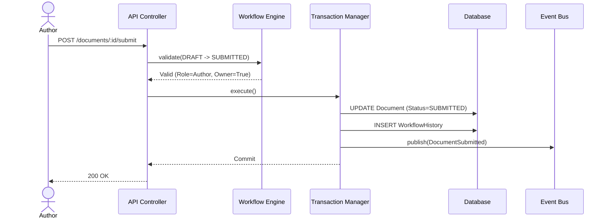

# Document Approval Workflow Engine

The Workflow Engine strictly enforces transition rules, ensuring that business logic is completely isolated from controllers and standard services. 

## State Machine
Valid transition paths:

## Sequence Diagrams

### Create & Edit Draft

### Submit Document

